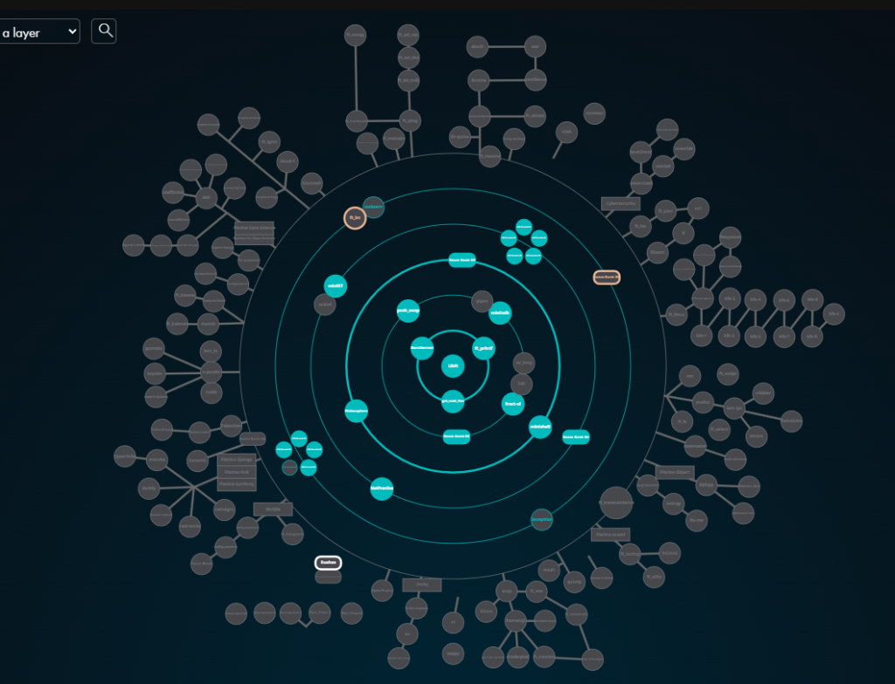

# 42 Common Core

This repository serves as the central directory for my implementations and solutions across the [42 School](https://42.fr/) Common Core curriculum at 42 Amman.

---

## Curriculum Progress (Holy Graph)

---

## Projects Overview

### Rank 00
| Project | Description | Language | Status |
| :--- | :--- | :---: | :---: |
| **[libft](https://github.com/ali-alemami/libft)** | Custom C standard library implementing essential libc functions and linked list utilities. | C | Completed |

### Rank 01
| Project | Description | Language | Status |
| :--- | :--- | :---: | :---: |
| **[ft_printf](https://github.com/ali-alemami/ft_printf)** | Custom implementation of formatted output conversion (`printf`). | C | Completed |
| **[get_next_line](https://github.com/ali-alemami/get_next_line)** | Reading text line-by-line from a file descriptor using static buffer persistence. | C | Completed |
| **Born2beroot** | System administration project: setting up a secure Debian VM with LVM, sudo policies, and UFW firewall. | SysAdmin | Completed |

### Rank 02
| Project | Description | Language | Status |
| :--- | :--- | :---: | :---: |
| **[push_swap](https://github.com/ali-alemami/push_swap)** | Dual-stack sorting algorithm using coordinate compression and lookahead binary radix sort. | C | Completed |
| **[pipex](https://github.com/ali-alemami/pipex)** | Unix pipeline simulator replicating shell redirection using `pipe()`, `fork()`, `dup2()`, and `execve()`. | C | Completed |
| **[minitalk](https://github.com/ali-alemami/minitalk)** | Client-server communication protocol using exclusively UNIX signals (`SIGUSR1`, `SIGUSR2`). | C | Completed |

### Rank 03
| Project | Description | Language | Status |
| :--- | :--- | :---: | :---: |
| **[philo](https://github.com/ali-alemami/philo)** | Multithreaded simulation of Dijkstra's Dining Philosophers using pthreads and mutexes. | C | Completed |

### Rank 04
| Project | Description | Language | Status |
| :--- | :--- | :---: | :---: |
| **[cpps](https://github.com/ali-alemami/cpps)** *(CPP 00–04)* | C++98 foundations: classes, Orthodox Canonical Form, inheritance, and subtype polymorphism. | C++98 | Completed |
| **NetPractice** | Practical networking exercises configuring IP addressing, subnet masks, and routing tables. | Networking | Completed |

### Rank 05
| Project | Description | Language | Status |
| :--- | :--- | :---: | :---: |
| **[cpps](https://github.com/ali-alemami/cpps)** *(CPP 05–09)* | Advanced C++98: exceptions, type casting, templates, and STL container algorithms. | C++98 | Completed |
| **inception** | Multi-service infrastructure with Docker Compose (NGINX with TLS, WordPress, MariaDB). | Docker / Bash | In Progress |
| **webserv** | Non-blocking HTTP/1.1 web server from scratch using socket I/O multiplexing. | C++98 | In Progress |
| **transcendence** | Full-stack single-page application featuring real-time multiplayer Pong. | TypeScript / Web | In Progress |

---

## Core Competencies Developed

- **Low-Level C Programming**: Memory management, pointer arithmetic, bitwise operations, system calls.
- **Unix Systems Architecture**: Process life cycles, file descriptor manipulation, IPC via signals and pipes, POSIX compliance.
- **Concurrent Programming**: Multithreading with pthreads, mutex synchronization, race-condition mitigation.
- **Object-Oriented Design**: Orthodox Canonical Form, inheritance hierarchies, abstract interfaces, templates in C++98.
- **System Administration & Networking**: Virtualization, Docker container orchestration, TCP/IP networking, subnet routing.
